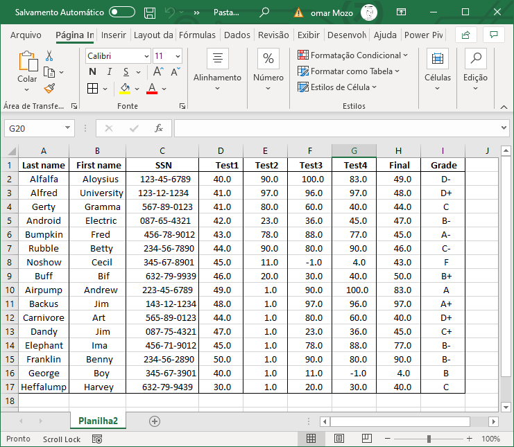

# Prova de Programação 02
Complete os seguintes códigos. Lembre-se de que os códigos não são necessariamente iguais aos originais.

## Como executar o código
Altere o arquivo `.replit`alterando o nome do arquivo que quer compilar e executar:

### Lenguagem python 
```
language = "python"
run = "python ex1.py"
``` 
Clique no botão `run`, que agora irá compilar e executar o arquivo **ex1.py**.

### Instalar bibliotecas
```
pip install opencv-python
```
## Recursos
### grades.csv
Um arquivo `CSV` (Valores Separados por Vírgula) é um tipo especial de arquivo que você pode criar ou editar no Excel. Em vez de armazenar informações em colunas, os arquivos CSV armazenam informações separadas por vírgulas.

O arquivo `grades.csv` seria uma planilha que mostra informações sobre alunos e as avaliações que tiveram numa disciplina.

**Lembre-se de que as linhas são separadas por uma quebra de linha (\ n) e que as colunas são separadas por uma vírgula (,)**



### {JSON} Placeholder
Placeholder e' uma API gratuita e de teste.
O recurso "users", aprecenta dados correspondente a distintos usuarios

https://jsonplaceholder.typicode.com/users

Um exemplo da resposta da API:
```
[
  {
    "id": 1,
    "name": "Leanne Graham",
    "username": "Bret",
    "email": "Sincere@april.biz",
    "address": {
      "street": "Kulas Light",
      "suite": "Apt. 556",
      "city": "Gwenborough",
      "zipcode": "92998-3874",
      "geo": {
        "lat": "-37.3159",
        "lng": "81.1496"
      }
    },
    "phone": "1-770-736-8031 x56442",
    "website": "hildegard.org",
    "company": {
      "name": "Romaguera-Crona",
      "catchPhrase": "Multi-layered client-server neural-net",
      "bs": "harness real-time e-markets"
    }
  ]
  ```
### restcountries.eu "Brasil"
A API restcountries fornece informações gerais do mundo, no seguinte link temos as informações correspondente com Brasil.

https://restcountries.eu/rest/v2/name/brasil

Um exemplo da resposta da API:

  ```
  {
   "name":"Brazil",
   "topLevelDomain":[
      ".br"
   ],
   "alpha2Code":"BR",
   "alpha3Code":"BRA",
   "callingCodes":[
      "55"
   ],
   "capital":"Brasília",
   "altSpellings":[
      "BR",
      "Brasil",
      "Federative Republic of Brazil",
      "República Federativa do Brasil"
   ],
   "region":"Americas",
   "subregion":"South America",
   "population":206135893,
   "latlng":[
      -10.0,
      -55.0
   ],
   "demonym":"Brazilian",
   "area":8515767.0,
   "gini":54.7,
   "timezones":[
      "UTC-05:00",
      "UTC-04:00",
      "UTC-03:00",
      "UTC-02:00"
   ],
   "borders":[
      "ARG",
      "BOL",
      "COL",
      "GUF",
      "GUY",
      "PRY",
      "PER",
      "SUR",
      "URY",
      "VEN"
   ],
   "nativeName":"Brasil",
   "numericCode":"076",
   "currencies":[
      {
         "code":"BRL",
         "name":"Brazilian real",
         "symbol":"R$"
      }
   ],
   "languages":[
      {
         "iso639_1":"pt",
         "iso639_2":"por",
         "name":"Portuguese",
         "nativeName":"Português"
      }
   ],
   "translations":{
      "de":"Brasilien",
      "es":"Brasil",
      "fr":"Brésil",
      "ja":"ブラジル",
      "it":"Brasile",
      "br":"Brasil",
      "pt":"Brasil",
      "nl":"Brazilië",
      "hr":"Brazil",
      "fa":"برزیل"
   },
   "flag":"https://restcountries.eu/data/bra.svg",
   "regionalBlocs":[
      {
         "acronym":"USAN",
         "name":"Union of South American Nations",
         "otherAcronyms":[
            "UNASUR",
            "UNASUL",
            "UZAN"
         ],
         "otherNames":[
            "Unión de Naciones Suramericanas",
            "União de Nações Sul-Americanas",
            "Unie van Zuid-Amerikaanse Naties",
            "South American Union"
         ]
      }
   ],
   "cioc":"BRA"
}
  ```
